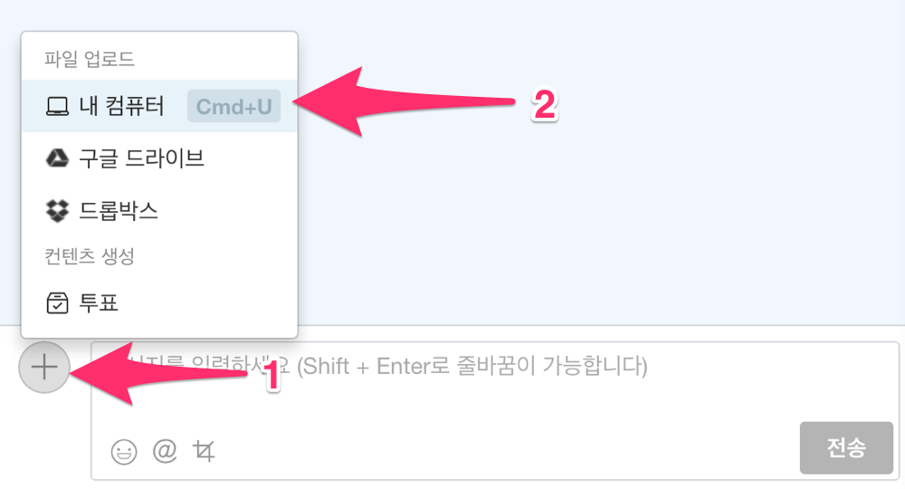
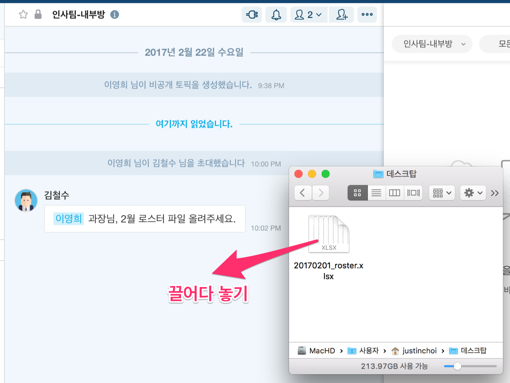
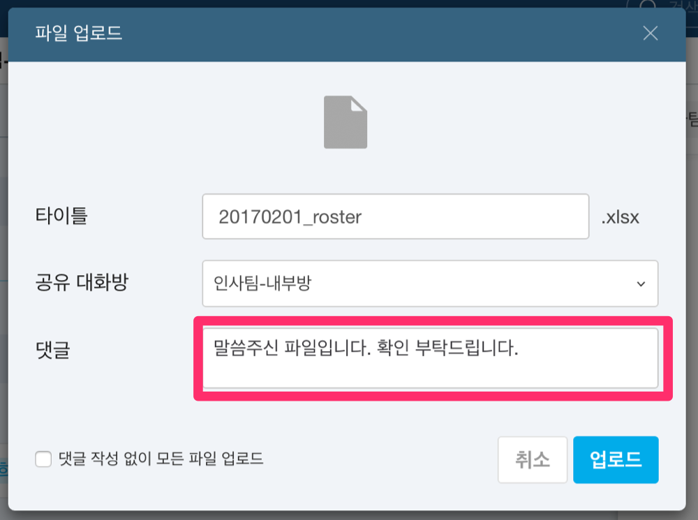
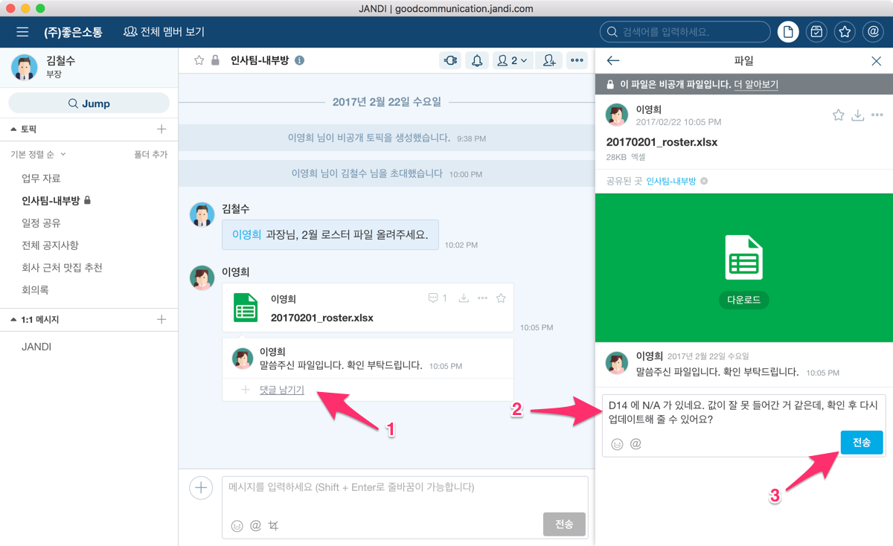
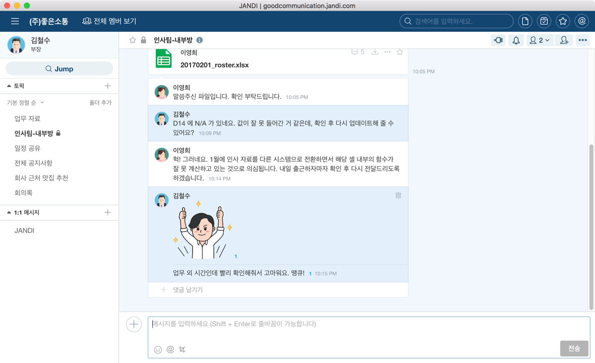
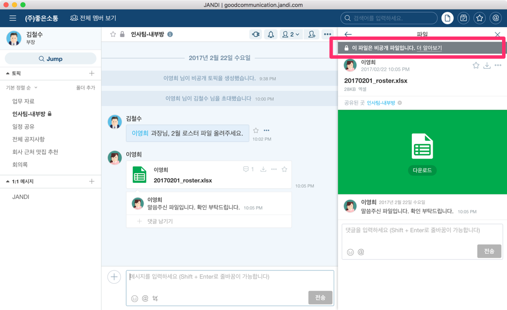
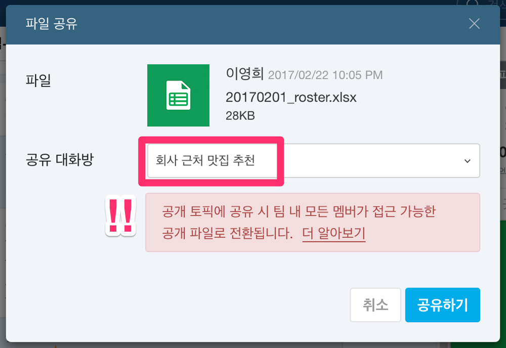

영구적인 파일 저장
=====

** 파일 데모 영상**

 https://www.youtube.com/watch?v=SzvPpWWN5uQ 

## 파일 업로드하고 댓글 달기

**잔디**는 컴퓨터에 있는 파일부터 Dropbox, Google Driver에 있는 파일뿐 아니라 모바일에서 사진과 동영상까지 업로드 할 수 있습니다. 파일을 업로드하는 여러가지 방법 중에서 먼저 자신의 컴퓨터에 있는 파일을 업로드하는 방법부터 알아봅니다.

PC의 경우, 대화 패널 하단의 `+` 버튼을 누르고 `내 컴퓨터` 메뉴를 클릭하여 파일 탐색기에서 선택하는 방법이나,

바탕화면이나 파일 탐색기에 있는 파일을 끌어다가 **잔디** 클라이언트에 놓으면(Drag & Drop) 업로드 대화창이 뜹니다.

업로드 대화창에서는 파일 이름을 수정하거나, 공유 대화방을 변경, 댓글을 달 수 있습니다. 만일 이러한 추가 정보를 원치 않고 업로드하고 싶은 경우 파일을 끌어서 놓을 때, `Shift` 키를 누른채로 놓으면 됩니다.

대화방에 업로드된 파일은 그 즉시 해당 대화방의 참여 멤버들과 **공유**됩니다. 멤버들은 댓글을 달면서 파일에 대한 의견을 주고 받을 수 있습니다. 파일을 업로드할 때 바로 댓글도 함께 달고 싶다면 아래와 같이 **파일 업로드** 대화창의 `댓글` 필드에 댓글을 입력하고 `업로드` 버튼을 누릅니다.

파일을 공유한 멤버들이 댓글을 입력해서 파일에 대한 피드백을 빠르게 나눌 수 있습니다.

첨부파일이 있는 이메일을 CC나 RE를 하면서 공유했다면 이와 같이 빠른 피드백은 기대할 수 없었을 겁니다.

### 다른 토픽에도 공유하기

> 이미 다른 토픽에 업로드한 파일을 다른 곳에도 공유할 수 있나요? 댓글을 함께 보고 싶습니다.

이런 분들을 위해서 공유에 대한 추가 기능을 알아보겠습니다.

### Dropbox 파일 공유하기

### Google Driver 파일 공유하기

### 여러개 파일 한꺼번에 업로드하기

## 비공개 파일이란?

> **[success] 비공개 파일의 특성은 무엇인가요?**
>
> - "비공개 토픽"이나 "1:1 대화"에 업로드 된 파일의 경우, **비공개 파일**이 됩니다.
> - 공유된 대화방에 참여하고 있지 않은 다른 멤버가 파일 검색 등을 통해 파일명을 보거나 파일의 댓글에 접근할 수 없습니다.
> - 비공개 파일은 파일이 공유된 대화방의 멤버들만 검색/열람/댓글/다운받을 수 있습니다.

반대로 공개 파일은 **잔디**의 조직원들이 검색이나 해당 파일이 공유된 공개 토픽에 접근하여 언제든지 열람할 수 있기 때문에, **기밀을 유지하고픈 사내 파일이 있는 경우 "비공개 토픽"이나 "1:1 대화"로 공유하세요.**

인사 정보와 같은 민감한 파일은 "인사팀-내부방"과 같은 **비공개 토픽**에 공유하였기 때문에, **비공개 파일**로서 해당 대화방에 참여하지 않은 멤버는 존재 여부조차 알 수가 없습니다.

> **[danger] 비공개 파일이 공개 파일로 변할 수 있나요?**
>
> 비공개 파일을 **공개 토픽에 공유**할 경우 모든 멤버가 검색하고 접근할 수 있는 공개 파일이 됩니다. **공개 파일이 되면 파일에 달렸던 댓글 또한 다른 멤버가 열람할 수 있게 됩니다. 한 번 공개 파일이 된 파일은 다시 비공개 파일의 속성을 가질 수 없으므로 공유에 유의해주시기 바랍니다.**
>
> 실수를 방지하기 위해 사용자가 비공개 파일을 공개 토픽에 공유를 시도하면 아래와 같은 경고가 뜹니다.

## 파일 삭제

## 파일 외부 공유하기

## 파일 다운로드 경로 지정(PC)
