우선 시작해보기
=====

**잔디**가 처음이신가요? 아래의 간단한 3가지 절차만으로 **잔디**의 가장 기본적인 활용 방법을 알아볼 수 있습니다. 그럼 **잔디**를 함께할 동료부터 초대해볼까요?

## 동료 초대하기
**잔디**를 제대로 사용하기 위해서는 우선 함께 소통할 동료가 필요합니다. 생성한 팀을 함께 사용할 동료를 초대하는 방법은 PC와 모바일에서 사용할 수 있습니다. PC 클라이언트의 경우, 좌상단의 `햄버거 메뉴`()를 클릭하고 `+ 새로운 멤버 초대하기`를 선택합니다.

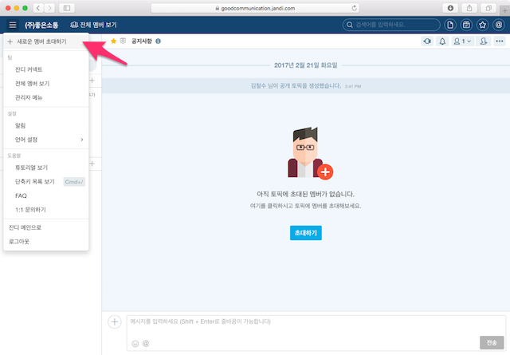

먼저 정회원으로서 동료를 초대해보겠습니다. `정회원 초대`를 선택하시고 초대하고자하는 회원의 이메일 주소를 입력합니다. 초대 메일은 공백 혹은 쉼표로 구분하여 여러 개를 한꺼번에 보낼 수도 있습니다. 엑셀 등의 스프레드 시트로 관리하는 경우 해당 열을 한꺼번에 복사해서 붙여넣기하면 됩니다. 입력을 마친 뒤, `초대 메일 보내기`를 클릭하시면 입력한 이메일 계정으로 이 팀의 초대장이 전송됩니다.

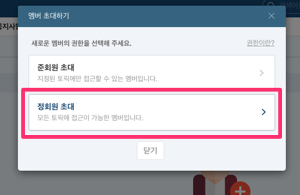
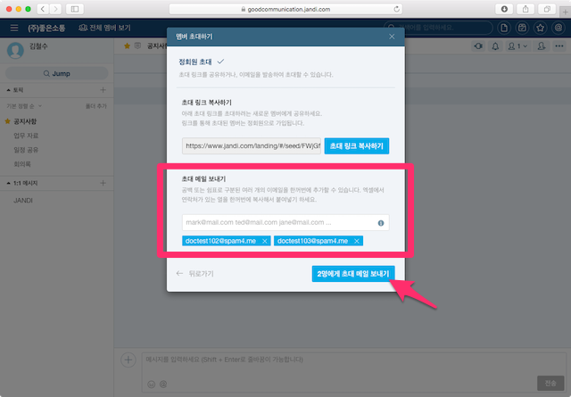
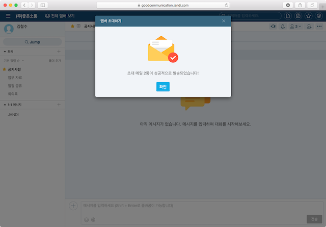

> **[success] 참고**
> 
> 아래와 같은 다양한 방법으로 동료들을 초대하는 법은 <[초대하기](invitation.md)>를 참고하세요.
> * 카톡이나 라인과 같은 메신저의 단체방에서 초대하는 방법
> * 초대 링크를 공유하여 초대하는 방법
> * 정회원, 준회원과 같은 권한을 구분하여 팀을 구성하는 방법
> * 관리자 외에 초대할 수 있는 사람을 막는 방법

그럼 다음으로, 자동으로 생성된 토픽들의 용도를 수정하고, 새로운 토픽들을 생성하여 여러분의 업무 성격에 맞게 협업 소통 창구를 구성하는 방법을 알아보겠습니다.

## 기본 토픽 수정하기

**토픽**은 한마디로 업무용으로 최적화 된 단톡방과 같은 개념입니다. 토픽의 정보를 변경해서 업무 성격에 맞게 최적화할 수 있습니다. 토픽을 관리하는 다양한 방법은 <[토픽과 1:1 대화](topic.md)>에서 설명드릴 예정이지만 우선 간단하게 아래와 같은 활용 사례에 맞게 수정해볼까요?

> "저희는 팀원이 너무 많아서 공지사항 토픽에 불필요한 대화가 자주 일어납니다. 경영진이나 인사팀처럼 **관리자만 메시지를 전달하고 다른 팀원들은 열람만 가능한 게시판 같은 용도**로 토픽을 사용할 순 없을까요?"

팀을 생성하면 자동으로 생성되는 토픽 중, "공지사항" 은 준회원을 제외한 모든 팀원들이 기본으로 참여하는 단체 대화방입니다. 이 토픽은 멤버가 나가거나 관리자가 삭제할 수 없습니다.

이 "공지사항" 토픽을 위와 같은 업무 성격에 맞게 수정해보겠습니다. 토픽 창의 오른쪽 상단에 위치한 `...` 버튼을 누르고 `정보 변경하기` 를 클릭합니다.

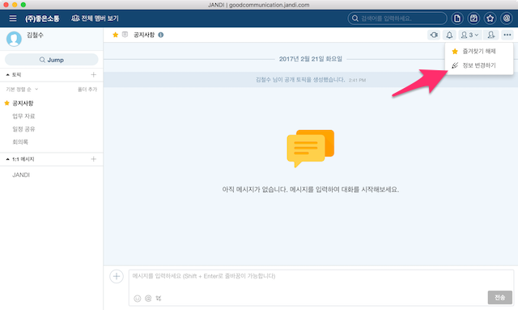

`읽기 전용 설정` 의 체크박스를 활성화하고 토픽의 `이름`을 "전체 공지사항"으로 바꿔보았습니다.

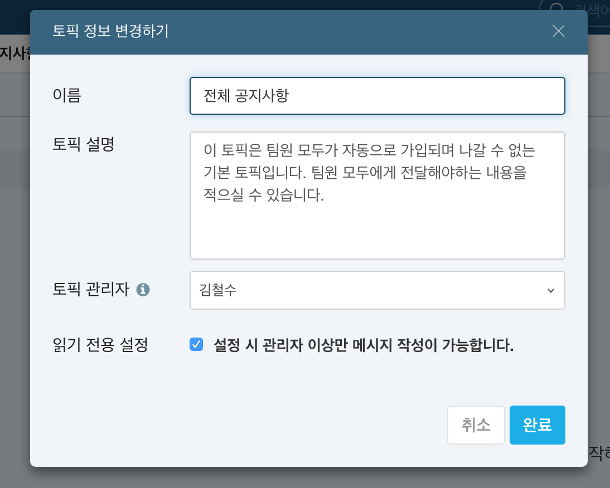

토픽의 상태가 읽기 전용으로 바뀌었고 이름 역시 변경된 것을 확인하실 수 있습니다. 이제 해당 토픽은 팀원들은 아래와 같이 메시지를 작성할 수 없게 됩니다. 하지만 회사의 중요한 전달사항은 다른 대화에 묻히지 않고 분명히 전파할 수 있겠네요.

## 토픽 생성하기

기본으로 생성되는 토픽이 아니라 회사의 소통 형태에 맞게 사용자가 대화방을 생성하고 조직원들을 초대하는 방법을 알아보겠습니다.

> **[info] Tip**
> 
> 먼저 추천드릴 대화방은 조직원들과 **가벼운 사담을 공적으로 나눌 수 있는 소통 창구**입니다. 커뮤니케이션 툴의 특성상 조직원의 대화를 가볍게 촉진시켜 놓으면 자연스럽게 업무 대화로 이어지는 것을 많은 성공적인 고객 사례를 통해 확인할 수 있었습니다.

PC의 경우 화면의 왼쪽 패널에서 토픽에 위치한 `+`를 누르고 `새로운 토픽 생성하기`를 클릭합니다.

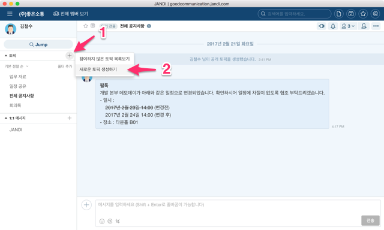

새로운 토픽을 생성하기 위한 대화창이 나옵니다. 대화방의 이름과 설명을 기입하고 `생성하기`를 누릅니다. (대화방의 이름은 필수적으로 입력해야 합니다.) 토픽을 관리하는 다양하고 강력한 방법들은 <[토픽과 1:1 대화](topic.md)>에서 알려드리겠습니다. 우선은 기본적인 생성 방법을 알아보겠습니다.

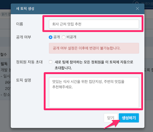

이제 대화방이 생성되었습니다. 하지만 본인을 제외한 아무도 해당 대화방에 초대되어 있지 않군요. 이제 함께 대화할 멤버들을 초대해보겠습니다. 대화 패널의 우측 상단을 보면 토픽을 제어하기 위한 다양한 버튼이 존재합니다. 이 중 `토픽에 멤버 초대하기`를 누르거나 대화창 가운데 위치한 `초대하기` 버튼을 눌러보겠습니다.

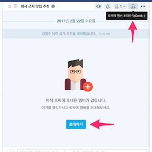

이제 토픽 초대를 위한 대화창이 보일 것입니다. 이 대화창에서 초대할 멤버를 선택할 수 있는 방법은 다음과 같습니다.
- 멤버 리스트에서 초대하고픈 멤버를 클릭하여 선택할 수 있습니다.
- 조직의 멤버가 너무 많아서 초대할 멤버를 찾기 어려운 경우, `검색창`을 사용해서 추가할 수 있습니다. "이름", "부서", "직책", "전화번호", "이메일" 등으로 검색할 수 있습니다.
- `모든 멤버 선택하기`를 클릭하면 조직의 모든 멤버가 자동으로 선택됩니다.

초대를 위해 선택된 멤버를 확인하고 활성화 된 `초대하기` 버튼을 누르면 초대가 완료됩니다.

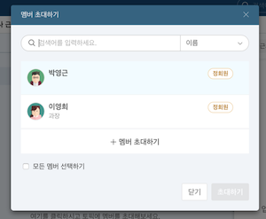
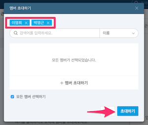

이제 새로운 토픽이 생성되고, 함께 대화를 나눌 멤버를 초대했습니다.

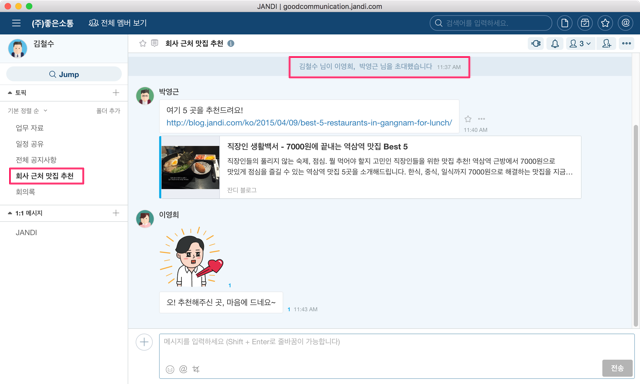

### 수고하셨습니다

지금까지 **잔디**를 이용해서 효과적인 업무를 수행할 수 있는 기본적인 튜토리얼을 수행하였습니다. 이제 본격적으로 **잔디**의 다양한 활용방법을 알아보겠습니다. 이 문서를 다 볼 수 있는 시간적 여유가 현재 부족하시다면 언제든지 https://docs.jandi.com 을 통해서 최신의 내용을 확인하실 수 있습니다.
