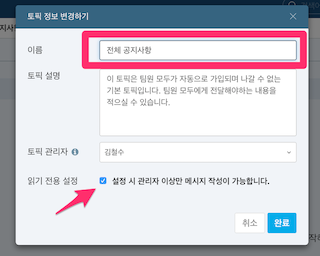
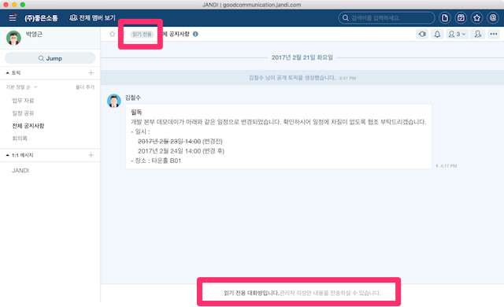

1 우선 시작해보기
=====

> 이미 회원 가입과 팀 생성을 완료하셨다면 [1.3 동료 초대하기](#13-동료-초대하기)부터 보세요.

## 1.1 회원 가입하기



## 1.2 팀 생성하기



## 1.3 동료 초대하기
**잔디**를 제대로 사용하기 위해서는 우선 함께 소통할 동료가 필요합니다. 생성한 팀을 함께 사용할 동료를 초대하는 방법은 PC와 모바일에서 사용할 수 있습니다. PC 클라이언트의 경우, 좌상단의 `햄버거 메뉴`()를 클릭하고 `+ 새로운 멤버 초대하기`를 선택합니다.

먼저 정회원으로서 동료를 초대해보겠습니다. `정회원 초대`를 선택하시고 초대하고자하는 회원의 이메일 주소를 입력합니다. 초대 메일은 공백 혹은 쉼표로 구분하여 여러 개를 한꺼번에 보낼 수도 있습니다. 엑셀 등의 스프레드 시트로 관리하는 경우 해당 열을 한꺼번에 복사해서 붙여넣기하면 됩니다. 입력을 마친 뒤, `초대 메일 보내기`를 클릭하시면 입력한 이메일 계정으로 이 팀의 초대장이 전송됩니다.

아래와 같은 다양한 방법으로 동료들을 초대하는 법은 [초대하기]를 참고하세요.
* 카톡이나 라인과 같은 메신저의 단체방에서 초대하는 방법
* 초대 링크를 공유하여 초대하는 방법
* 정회원, 준회원과 같은 권한을 구분하여 팀을 구성하는 방법
* 관리자 외에 초대할 수 있는 사람을 막는 방법

그럼 다음으로, 자동으로 생성된 토픽들의 용도를 수정하고, 새로운 토픽들을 생성하여 여러분의 업무 성격에 맞게 협업 소통 창구를 구성하는 방법을 알아보겠습니다.

## 1.4 기본 토픽 수정하기

**토픽**은 한마디로 업무용으로 최적화 된 단톡방과 같은 개념입니다. 토픽의 정보를 변경해서 업무 성격에 맞게 최적화할 수 있습니다. 토픽을 관리하는 다양한 방법은 [토픽]에서 설명드릴 예정이지만 우선 간단하게 아래와 같은 활용 사례에 맞게 수정해볼까요?

> "저희는 팀원이 너무 많아서 공지사항 토픽에 불필요한 대화가 자주 일어납니다. 경영진이나 인사팀처럼 **관리자만 메시지를 전달하고 다른 팀원들은 열람만 가능한 게시판 같은 용도**로 토픽을 사용할 순 없을까요?"

팀을 생성하면 자동으로 생성되는 토픽 중, "공지사항" 은 준회원을 제외한 모든 팀원들이 기본으로 참여하는 단체 대화방입니다. 이 토픽은 멤버가 나가거나 관리자가 삭제할 수 없습니다. 

이 "공지사항" 토픽을 위와 같은 업무 성격에 맞게 수정해보겠습니다. 토픽 창의 오른쪽 상단에 위치한 `...` 버튼을 누르고 `정보 변경하기` 를 클릭합니다.

`읽기 전용 설정` 의 체크박스를 활성화하고 토픽의 `이름`을 "전체 공지사항"으로 바꿔보았습니다.

토픽의 상태가 읽기 전용으로 바뀌었고 이름 역시 변경된 것을 확인하실 수 있습니다. 이제 해당 토픽은 팀원들은 아래와 같이 메시지를 작성할 수 없게 됩니다. 하지만 회사의 중요한 전달사항은 다른 대화에 묻히지 않고 분명히 전파할 수 있겠네요.

## 1.5 토픽 생성하기
