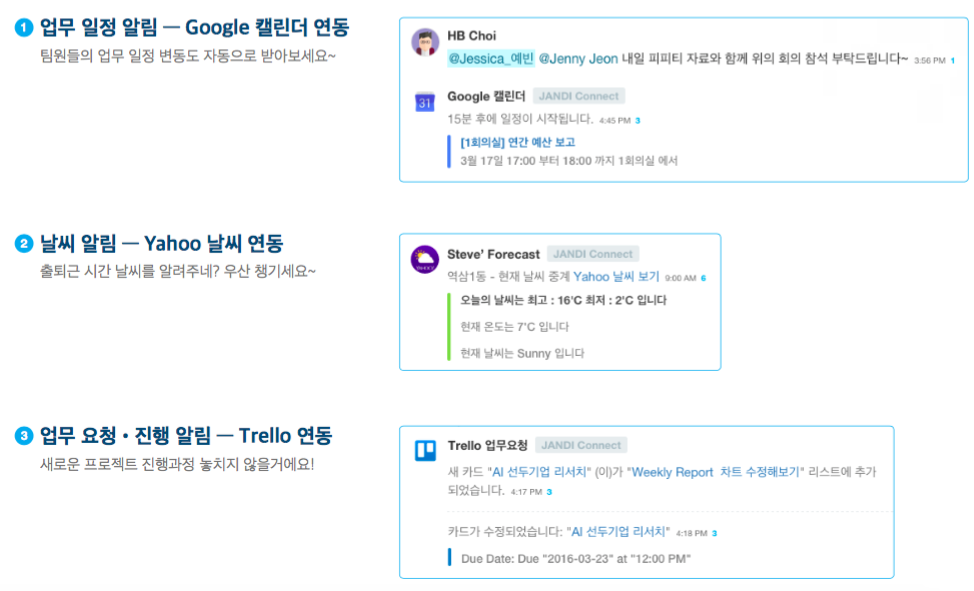
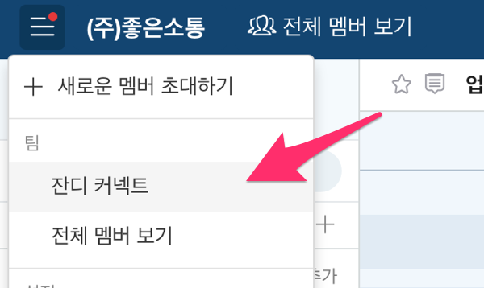
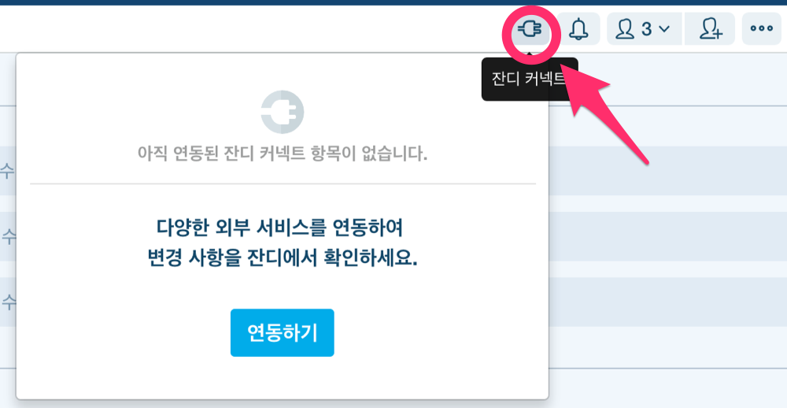

연동 기능 소개
=====

**잔디 커넥트(JANDI Connect)**는 타 서비스를 **잔디**에 연결하여 메시지 알림을 받는 기능입니다. 여러 서비스를 계속 왔다갔다할 필요 없이 잔디에서 바로 자주 사용하는 서비스로 이동할 수 있어 편리합니다. 간단하게 이런 종류의 서비스를 **잔디**에서 확인하실 수 있습니다.

현재 제공되고 있는 서비스는 아래와 같습니다.

* Google calendar
* GitHub
* Bitbucket
* JIRA
* Trello
* RSS 구독
* 커스텀 연동 = Webhook 수신(Incoming Webhook)

## 잔디 커넥트 실행 방법
PC 화면 좌상단의 `햄버거 메뉴`()를 클릭하고 `잔디 커넥트` 메뉴를 클릭하거나,

대화 패널의 우측상단에 위치한 플러그 모양의 `잔디 커넥트` 버튼을 클릭합니다.

이제 원하는 서비스의 리스트를 보고 연동 및 수정할 수 있습니다. 각각의 설명 문서로 이동하여 연동 방법을 참고하세요.

> **[success] 다른 회사는 어떤 식으로 활용하나요?**
>
> - [잔디 커넥트 활용사례 더보기](https://drive.google.com/file/d/0B2SF4Wyqtyn_Ny1mYW1fMl9VV0U/view)를 보시면 다양한 활용 사례를 확인하실 수 있습니다.
> - 아직 원하시는 연동 서비스가 없나요? 그렇다면 [잔디 커넥트 서비스 요청](https://jandi.typeform.com/to/rVKGjd) 설문조사에서 의견을 남겨주세요.

