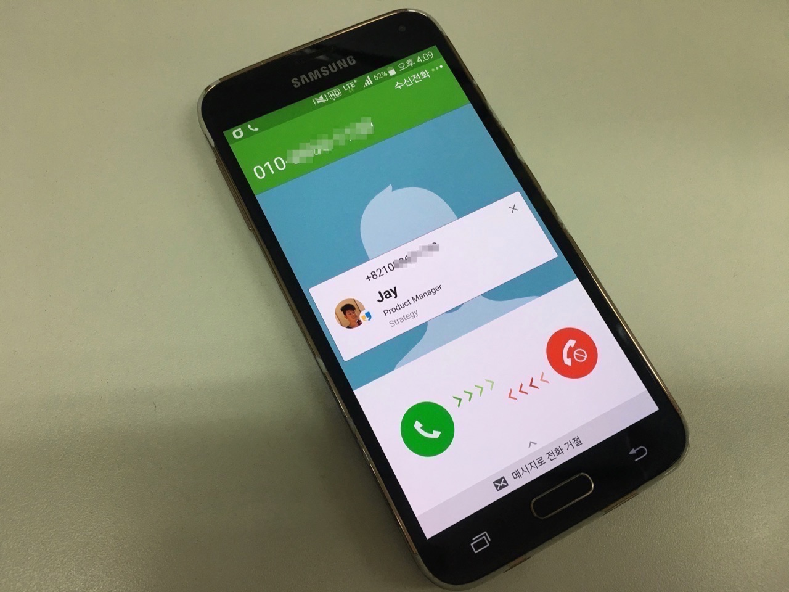
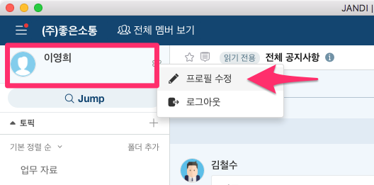
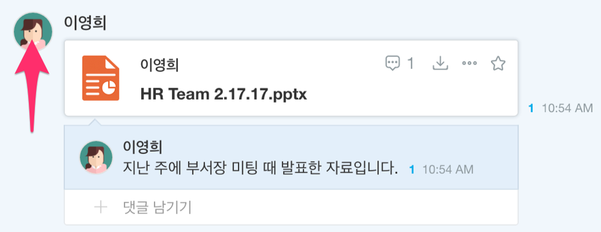
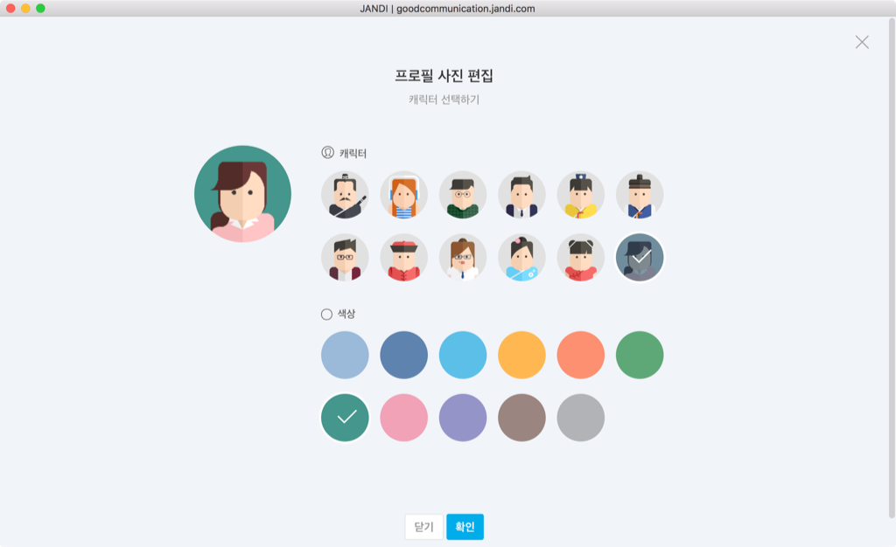
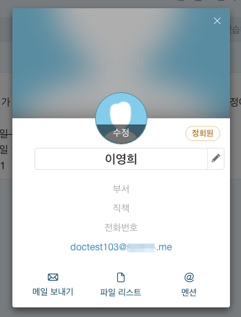
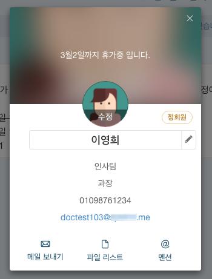

프로필 설정하기
=====

**잔디**에서 나를 나타내는 프로필을 설정해놓으면, 동료들이 나를 손쉽게 인지하고 빠르게 검색할 수 있습니다. 프로필로 설정할 수 있는 항목은 다음과 같습니다.
- 사진 : 당장 사진이 없으면 **잔디**가 준비해놓은 캐릭터를 선택할 수 있습니다
- 이름
- 부서명
- 직책
- 전화번호
- 이메일
- 상태 메시지

> **[info] 사진과 전화번호를 등록해두면 2배로 편해집니다**
>
> 전화번호를 등록해놓으면 **잔디 모바일**이 설치된 스마트폰에서 업무가 편해집니다. 동료의 전화번호를 주소록에 미리 저장해두지 않아도 되고, 해당 번호로 전화가 오면 **잔디**에 등록된 사진과 프로필로 수신 확인이 됩니다.

## 내 프로필 설정하기

본인의 프로필을 볼 수 있는 곳 어디서든 바로 수정할 수 있습니다.

PC 화면의 좌상단에 프로필 창을 클릭해서 들어갈 수도 있고,

대화창에서 본인의 프로필 사진을 클릭해서 들어갈 수도 있습니다.

> **[info] 지금 사진이 없다면 잔디 캐릭터를...**
>
> 당장 프로필로 사용할 사진이 없다면 **잔디**가 미리 만들어놓은 캐릭터를 이용해보시는 것은 어떨까요? 캐릭터와 배경 색상을 사용해서 다양한 조합의 캐릭터를 생성할 수 있습니다.

프로필의 각 항목을 클릭하면 상태, 사진, 이름, 부서, 직책, 전화번호, 이메일을 수정할 수 있습니다. 프로필을 수정한 전과 후입니다.

## 전체 프로필 수정하기(관리자)

관리자는 모든 동료의 프로필을 수정할 수 있습니다. 부서나 직책 등이 회사의 정책과 다르게 잘 못 표기되어 있는 것을 확인하셨다면 즉시 수정하세요.

> **[warning] 잠깐만요!**
>
> Q. 전체 회원들을 한눈에 보면서 프로필을 수정할 수 있는 방법은 없나요?
> 
> A. 3월 말에 업데이트할 조직도 보기 기능을 통해서 한번에 동료들의 프로필에 접근할 수 있습니다. 조금만 더 기다려주세요.